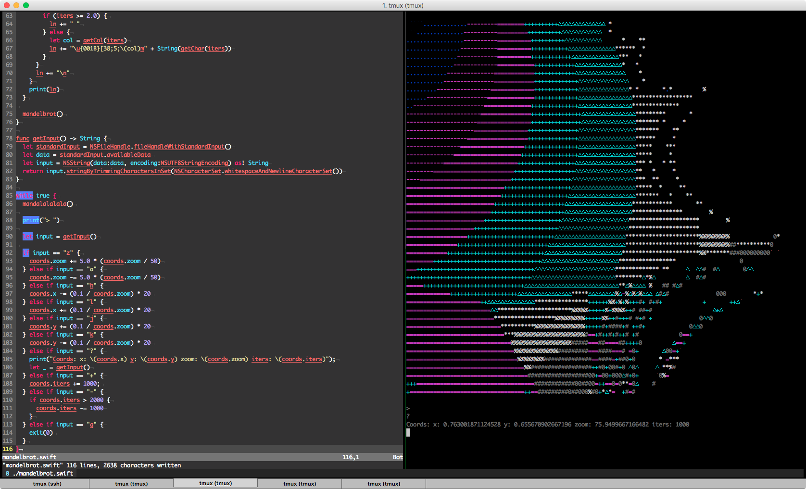

# swift-mandelbrot

This is what I made when I tried to learn Swift.

It has keyboard commands, but you have to press return after pressing the desired character:

* `hjkl`: Movement
* `z`: Zoom in
* `a`: Zoom out
* `+`: Draw with more iterations
* `q`: Quit
* `?`: Show current coords/iters
